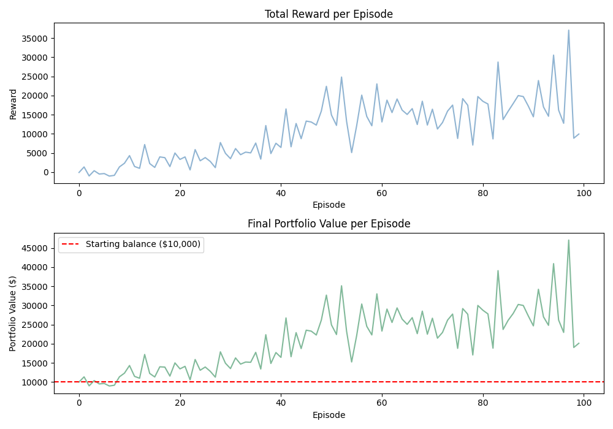
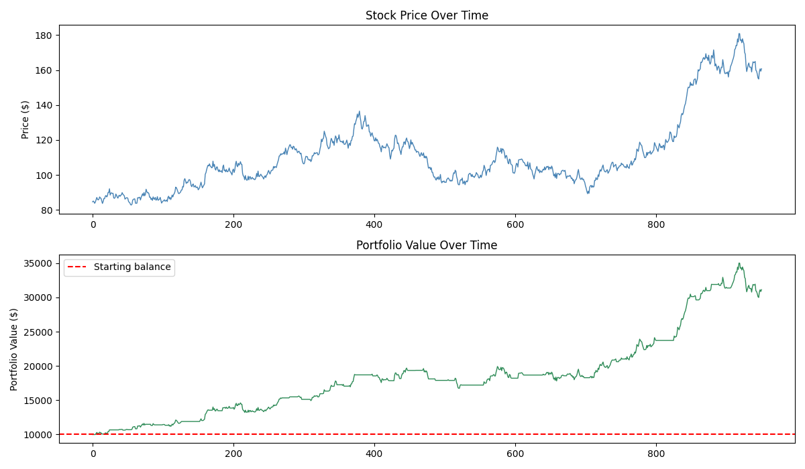

# Stock Trading Agent

A reinforcement learning agent that learns to trade stocks using Q-learning. The agent observes market conditions and decides whether to buy, sell or hold at each step, with the goal of maximising portfolio value over time.

This is a personal project to get hands-on with RL concepts like reward shaping, exploration vs exploitation, and building custom environments from scratch.

## How it works

The agent interacts with a custom trading environment that simulates daily stock price movements. At each step it receives a state (price, moving averages, daily returns, whether it's holding a position) and picks one of three actions: hold, buy, or sell. It learns by updating a Q-table based on the reward it gets, which is the change in portfolio value after each action.

## Project structure

```
stock-trading-agent/
├── src/
│   ├── environment.py    # custom trading environment
│   ├── agent.py          # Q-learning agent
│   └── generate_data.py  # generates sample stock price data
├── data/                 # stock data CSV goes here
├── models/               # saved Q-table after training
├── results/              # training and evaluation plots
├── train.py              # run this to train the agent
├── evaluate.py           # run this to test the trained agent
└── requirements.txt
```

## Setup

```bash
git clone https://github.com/Kare100/stock-trading-agent.git
cd stock-trading-agent
pip install -r requirements.txt
```

## Usage

Generate sample data and train the agent:

```bash
python train.py
```

This runs for 100 episodes and saves the Q-table to `models/q_agent.pkl`. A training plot is saved to `results/`.

Then evaluate the trained agent:

```bash
python evaluate.py
```

This prints a summary of final portfolio value and profit/loss, and saves a performance chart to `results/`.

## Example output

I ran this for 100 episodes on simulated stock data. Here's what came out of it:

```
Starting balance : $10,000.00
Final value      : $31,125.19
Profit/Loss      : +$21,125.19 (+211.25%)

Action breakdown:
  Hold: 688 times
  Buy: 185 times
  Sell: 77 times
```

Training progress (reward and portfolio value climbing over episodes):



Evaluation on the trained agent (price vs portfolio value over time):



Worth noting this is simulated price data, not real market data, so results are cleaner than what you'd see in practice. Still, it shows the agent is actually learning to buy low and sell high rather than just doing something random.

## What I want to improve

- replace Q-table with a deep Q-network (DQN) using PyTorch
- use real historical data from Yahoo Finance via yfinance
- add more state features like RSI and Bollinger Bands
- implement position sizing instead of all-in buy/sell
